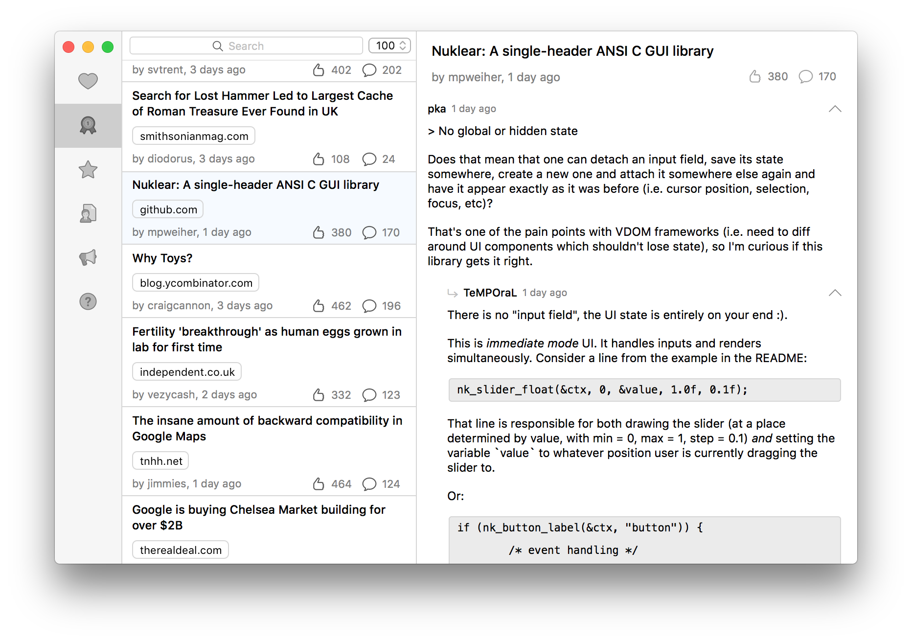
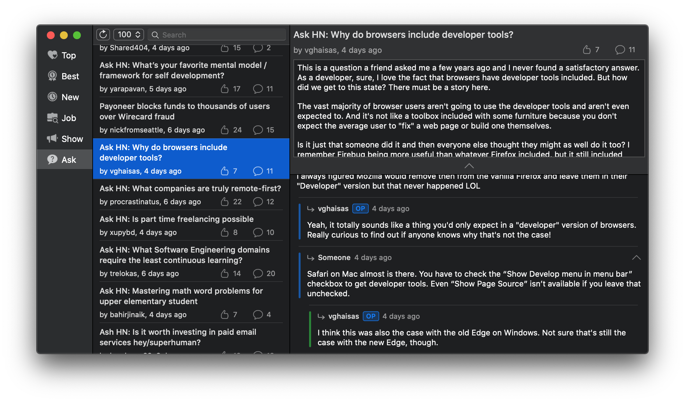

# 📰 Diurna
Basic/Classic Hacker News app, used as a Cocoa &amp; Swift learning platform

## ⚠️ Warning
The code leaves a lot to be desired (I am only working on this from time to
time and am still learning), as does the git history.

## 🔨 Building

This project consists in a workspace and two projects, `App` and
`HackerNewsAPI`.  As their names suggest, the first is a good old AppKit macOS
application, and the second is a framework where all interactions with the
[official HN API](https://github.com/HackerNews/API) are handled.

There are two prerequisites for running the app:

- You need to [set up](https://firebase.google.com/docs/ios/setup?authuser=0#create-firebase-project)
  your own Firebase project and provide the corresponding
  `GoogleService-Info.plist` file by placing it in the `App/Resources` directory.
  The `DATABASE_URL` key should however always be set to the official HN API URL,
  i.e. `https://hacker-news.firebaseio.com`.

- Dependencies are managed through [Cocoapods](https://cocoapods.org); You must
  execute `pod install` in the project directory in order to retrieve them, once
  you have cloned it.
 
## 📝 TODO

- [ ] user preferences
- [ ] fix comment folding 
- [ ] fix code blocks layout
- [ ] comment row height cache
- [ ] proper networking
- [ ] user login & voting
- [ ] polls
- [ ] proper toolbar
- [ ] propert search, using [https://hn.algolia.com](algolia)
- [ ] more icons?

... And many more.

## 📸 Screenshots

